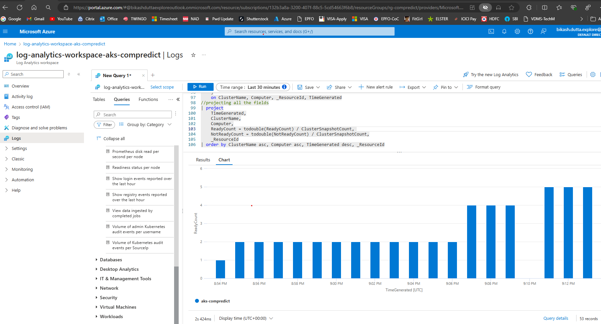

# DevOps task for Compredict
Thank you for providing me the opportunity to work on the Task and I have gained a lot of knowledge that has ultimately helped me in delivering the Task.

## A Summary of my Task:-
1. I have provisioned a Azure Kubernetes Service (AKS) Cluster using Terraform
2. I have installed Flux on the provisioned AKS Cluster using Terraform. Then I bootstrapped a newly created Git Repository with the Cluster and verified my installations.
3. I created the Kubernetes manifests of a simple nginx web application and have deployed it to the AKS Cluster using Flux Kustomization. This was achieved when I committed the code to the newly created Git repository (https://github.com/Bkassh/compredict-demoapp) in a Structured Directory.
4. I have integrated Prometheus and Grafana for monitoring my Kubernetes resources.
5. I have integrated Azure Log Analytics to aggregate logs from the nodes and pods available in the created AKS Cluster.
6. I finally destroyed the AKS Cluster and its resources without the use of manual steps.

Now, I will explain the Summary points in detail and the steps I followed which should also be replicated to validate my Task.

### Pre-requisites for the Task
1. A valid Pay-on-the-go Azure Subscription. The following namespaces had to be registered in my Azure subscription which I did with the az commands below.
    a. az provider register --namespace Microsoft.Monitor
    b. az provider register --namespace Microsoft.Dashboard
    c. az provider register --namespace Microsoft.AlertsManagement
    d. az provider register --namespace Microsoft.ContainerService
    e. az provider register --namespace Microsoft.PolicyInsights
2. VSCode or similar IDE.
3. Git, AzureCLI, Terraform and Kubectl installed in the system (I am using Windows) and integrated with the VSCode terminal.
4. A Free Github account with provisions to create Repositories, Personal Access Tokens.
5. A Free Account in HCP Terraform Cloud (https://app.terraform.io/)
6. Windows Powershell ISE application.

### 1. Provision AKS Cluster using Terraform

#### Why did I choose Azure Kubernetes Service Cluster?
1. I have a valid Azure Subscription which I use to test, learn and keep myself updated with the ever-growing universe of DevOps, GitOps and MLOps.
2. I am Microsoft Certified on Azure Fundamentals (AZ-104) and Fundamentals of Generative AI (AI-900)
3. AKS Cluster provides a fully managed Kubernetes cluster, making it easy to deploy, manage, and scale containerized applications on a large scale without worrying about the underlying infrastructure.

I securely deployed an AKS Cluster via Github Action workflows that ran my terraform code on Terraform Cloud which I achieved by registering Github as the OpenID Connect (OIDC) to authenticate into my Azure Subscription. I created a Sub Version (SVN) application in my Microsoft Entra ID account to provision the OIDC authentication. The complete workflow can be understood having a look at the diagram with mentioned steps below.

#### How did I create an SVN application and provisioned Github Actions and Terraform cloud to authenticate to my Azure Subscription as shown above?
1. In my Microsoft Entra ID account I created an SVN app named "oidc-app-compredict".
2. In the SVN app I created the Client secret as shown below following general procedures.

3. I also created Federated Credentials in the SVN app as shown below, where I provided the Github username / organisation name, repository name and branch details.

4. I assigned a role to the SVN app as a "Contributor" so that it has the necessary rights in the Azure Subscription, whose secrets and federated credentials will be used for Github OIDC authentication to my Azure Subscription.
5. Now in the Github repository (compredict-demo) settings (Not user account settings) I created the secrets by navigating as below.

6. In the actions I added the Client_ID, Tenant_ID and Subscription_ID which I obtained from the SVN app overview like below.

7. Now in Terraform Cloud I created an API token (shown below) which I added as an action secret in Github repository naming as TFC_TOKEN_ID as shown in the above picture.

8. After this in my Terraform Cloud workspace I added the following variables with the same values obtained from the SVN app overview with the secret value being a new addition as shown below. The workspace variable had to follow the exact naming convention and "Category" as shown below or else the workflow would break. I wasted a lot of time scratching and debug why my workflow was breaking as I was not following the exact naming convention initially.

9. Now I could safely and securely run the Github Action workflows as available in the .github\workflows path.
10. The workflows folder has the .yml files for the Github Action workflows, which I could run to create the AKS Cluster (shown below). There is no manual intervention involved as I only had to run the "1. Create Azure K8s Cluster for Compredict GitOps Demo and monitor with Prometheus and Grafana" workflow.

### 2. Install Flux to the AKS Cluster and use it to Bootstrap the Cluster with a New Git Repository

With running of the Github Actions "1. Create Azure K8s Cluster for Compredict GitOps Demo and monitor with Prometheus and Grafana" workflow, the AKS Cluster is created and the Flux is installed in the AKS Cluster. This is because the "terraform apply auto-approve" command applies the complete change (AKS Cluster Creation + Flux install) as the terraform files in the "infrasttructure" folder are in the same Terraform state.

In fluxcd.tf the kubernetes_secret resource requires a Personal Access Token created in the Github Account settings which authenticates the Flux Kustomization configuration to read the commits in the Git repository mentioned path (./app) and manage the deployment in the AKS cluster.

### 3. Deploy Nginx web application in the AKS Cluster using Flux and verify whether Flux manages the AKS resources with changes pushed in the Git Repository

When I created the AKS cluster I added two labels namely "app" and "environment" in the nodes to showcase Node Affinity module which is ideal for a production scenerio where a pod only has to run on a node with a specific CPU or in a specific availability zone. The code is available in the deployment manifests which effectively makes the nginx app pod run on the node labeled with the above two labels.

The Kubernetes Manifests for the nginx app is available in a structured directory in the other repository (https://github.com/Bkassh/compredict-demoapp) and the Flux CD manages the deployment well in the AKS cluster with changes made in the manifests. To check that, I changed the replicaset in the production deployment manifest file from "1" to "2" and I could see within 60 seconds two pods are created in the AKS cluster node.

The deployed nginx application is viewed as follows.

### 4. Integrate Prometheus and Grafana for monitoring my Kubernetes resources

The Github Actions "1. Create Azure K8s Cluster for Compredict GitOps Demo and monitor with Prometheus and Grafana" workflow, applies the complete change (AKS Cluster Creation + Flux install + enable Prometheus and Grafana) as the terraform files in the "infrasttructure" folder are in the same Terraform state.

In the workflow after AKS cluster creation, in the step "AKS Monitoring Enabler", the helm commands adds, updates and installs the Prometheus and Grafana repository to the AKS Cluster to enable the respective monitoring tools. A new namespace named "monitoring" is also created.

After a successful "terraform apply" I set the AKS cluster kubeconfig in my system to login to the AKS cluster and did a port forward to access the Grafana Dashboards using kubectl command.
The commands are :
1. "az aks get-credentials --resource-group rg-compredict --name aks-compredict"
2. "kubectl port-forward svc/prometheus-grafana 8080:80 --namespace monitoring"

After this I could access the Grafana dashboards in url 127.0.0.1:8080/login using the Username as "admin" and Password as "prom-operator". One of the dashboard is shown below:

I also had run the below command to check the status of the prometheus pods:
 kubectl get pods -l "release=prometheus" --namespace monitoring
I could successfully see the prometheus pods as shown below.

### 5. Integrate Azure Log Analytics to aggregate logs from the nodes and pods available in the created AKS Cluster

The Github Actions "1. Create Azure K8s Cluster for Compredict GitOps Demo and monitor with Prometheus and Grafana" workflow, applies the complete change (AKS Cluster Creation + Flux install + enable Prometheus and Grafana + add Azure log Analytics workspace) as the terraform files in the "infrastructure" folder are in the same Terraform state.

After successful cluster creation I was able to see the Azure Log analytics workspace as shown below.

Now I opened the Windows Powershell ISE application in my windows system and provisioned login to my azure subscription on the app using general poweshell commands and then had to open the "ARMDeployment.ps1" poweshell script available in the container-analytics folder. 

I would suggest to download the whole "container-analytics" folder into your windows system. Now I had to update the required parameters in the "ContainerInsightsExistingClusterOnboarding.json", "ContainerInsightsExistingClusterParam.json" and "ARMDeployment.ps1" poweshell script with the Azure Subscription and AKS cluster parameters. Some of them are shown below.

After that I had to run the deployment command as shown below:

this deployed the analytics resources successfully and now when I went to the loganalytics workspace namely "log-analytics-workspace-aks-compredict" and clicked on the Logs menu, it showed the following metrics

With this I could successfully integrate a log aggregation tool in my AKS Cluster and check on the node and pod insights available in the AKS Cluster.

### 6. Destruction of the AKS Cluster without the use of Manual steps

The Github Actions "2. Destroy Azure K8s Cluster for Compredict GitOps Demo" workflow, when initiated completely destroys the AKS Cluster and its resources without the need of any manual intervention.

With this I have explained in details how I have carried out the task that Compredict Team has provided. I thank them again for their planning of the task.
I am new to writing README files, I have double checked for error while writing but if something wrong pops up, then kindly excuse.
Looking forward for more.

--Bikash Dutta
